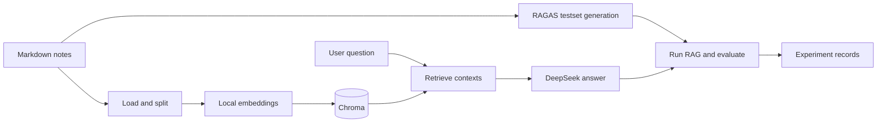

# Personal Notes RAG

一个面向个人 Markdown 笔记的检索增强生成（RAG）实验项目。

这个仓库的重点不是快速拼出一个问答界面，而是建立一套可复现的 RAG 实验方法：先实现稳定的基线，再生成测试集、量化评估，最后让混合检索等优化方案在同一评测条件下与基线比较。

## 文档与结果入口

- [`docs/ROADMAP.md`](docs/ROADMAP.md)：阶段计划、候选实验与验收标准。
- [`docs/RESULTS.md`](docs/RESULTS.md)：已经验证的实验条件、指标、结论与证据。
- `experiments/`：完整终端输出、失败排查和阶段性观察。
- `output/`：当前运行产生的测试集与逐样本评测结果。

README 只说明稳定的项目入口、架构和复现方式。尚未验证的能力只在路线图中作为计划出现；已完成的实验结果则以 `docs/RESULTS.md` 为准，保留历史基线而不覆盖旧结论。

## 已验证结果

项目已经跑通基线问答和 RAGAS 评测闭环。当前公开基线包含 20 条测试样本上的四项 RAGAS 指标，以及 Embedding、LLM、chunk 与端到端冒烟测试的记录。具体实验条件、指标解释、复现边界和证据文件见 [`docs/RESULTS.md`](docs/RESULTS.md)。

## 项目目标

- 将个人 Markdown 笔记构建为可检索的本地知识库。
- 让 DeepSeek 基于检索到的上下文生成回答，并在资料不足时拒答。
- 自动生成测试集，量化检索与生成质量。
- 记录每个阶段的实验条件、结果、问题与结论，让后续优化有可靠对照。

## 总体架构



## 三条工作线

项目目前按三条彼此关联的工作线推进。

| 工作线 | 目标 | 核心产物 |
| --- | --- | --- |
| 建库与生成线 | 建立可运行、可复现的 RAG 基线 | Chroma 索引、`rag_answer()`、基线问答结果 |
| 测试集与评估线 | 用统一数据集衡量 RAG 的检索与生成表现 | `testset.csv`、`eval_result.csv`、实验记录 |
| 混合检索生成线 | 引入混合检索等优化，与基线进行同条件对比 | 优化方案、对照实验、指标变化分析 |

三条线的关系是：

```text
基线建库与生成
    -> 生成测试集并固定评测条件
    -> 得到基线分数
    -> 实现混合检索生成
    -> 使用相同测试集再次评测
    -> 比较指标与案例，而不是只凭主观感受判断效果
```

## 目录说明

```text
RAG/
├── config/                         # 统一配置管理
│   └── settings.py                  # 模型、路径、切分、检索等参数
├── experiments/                    # 阶段验收与实验结果记录
├── indexing/                       # 向量化存储层
│   └── vectorstore.py               # Chroma 构建与连接封装
├── output/                         # 运行时输出
│   ├── testset.csv                  # RAGAS 自动生成的测试集
│   └── eval_result.csv              # RAGAS 评测结果
├── scripts/
│   ├── test/                        # 项目早期的冒烟测试与局部验证脚本
│   ├── build_vectorstore.py         # 建库：加载、切分、向量化、写入 Chroma
│   ├── RAG_pipeline.py              # 基线检索与生成主链路
│   ├── TestsetGenerator.py          # 自动生成测试评估数据集
│   └── evalute.py                   # 执行 RAGAS 定量评估
├── data/                            # 本地笔记与 PDF，不提交到 Git
└── chroma_db/                       # 本地 Chroma 数据，不提交到 Git
```

### `config/`：统一配置管理

所有可调参数集中在 `config/settings.py`，包括：

- DeepSeek API 配置与模型名。
- 本地 Embedding 模型路径。
- Chroma 持久化路径与集合名。
- Markdown 数据路径与输出路径。
- `chunk_size`、`chunk_overlap`、`retrieval_top_k` 等实验参数。

设计原则是：做 A/B 实验时优先改配置，而不是改业务主链路。

### `experiments/`：实验记录

这里保存阶段验收结果、错误定位过程和指标解释。每次实验至少记录：目标、改动、数据范围、测试集、结果、结论和下一步。

现有记录包括：

- `基线测试结果记录.md`：Embedding、LLM、chunk 与 RAGAS 基线结果。
- `初期结果评估记录.md`：早期 RAGAS 评估异常与定位过程。
- `库版本冲突解决流程.md`：RAGAS 与 LangChain 生态兼容问题的处理记录。

### `indexing/`：向量化存储

`indexing/vectorstore.py` 封装 Chroma 的构建与读取。业务脚本不直接操作 Chroma，后续若替换为 Qdrant、Milvus 或 PGVector，优先修改这一层。

### `output/`：统一输出

运行过程产生的测试集和评测结果统一存放在 `output/`，避免结果散落在代码目录中：

- `testset.csv`：RAGAS 根据笔记自动生成的问题、参考上下文和参考答案。
- `eval_result.csv`：实际 RAG 响应与各项评测分数。

### `scripts/`：可执行实验脚本

`scripts/test/` 保存项目初期的冒烟测试：验证本地 Embedding、DeepSeek API 与完整链路是否可运行。

其余脚本是当前阶段的建库、基线问答、测试集生成和量化评估入口，构成上述三条工作线的执行层。

## 基线建库与生成线

当前基线使用固定长度切分、向量相似度检索和上下文约束生成：

```text
Markdown documents
-> DirectoryLoader
-> RecursiveCharacterTextSplitter
-> Qwen3-Embedding-0.6B
-> Chroma
-> similarity_search(top-k)
-> DeepSeek
```

核心入口位于 `scripts/RAG_pipeline.py`：

- `retrieve(question, top_k)`：从 Chroma 取回相关片段。
- `generate(question, top_k, context)`：将问题与片段组装为 Prompt，调用 DeepSeek。
- `rag_answer(question, top_k)`：执行完整的检索与生成流程。

Prompt 要求模型只依据参考资料回答；当资料不足时，返回“抱歉，我无法回答这个问题。”

## 测试集与评估线

### 测试集生成

`scripts/TestsetGenerator.py` 使用 RAGAS 基于 Markdown 笔记生成单跳测试问题、参考上下文和参考答案。

项目针对实际运行环境处理了几类兼容问题：

- RAGAS 与新版 `langchain_community` 的导入兼容。
- Markdown 标题不稳定时的文档节点主题抽取。
- DeepSeek OpenAI-compatible API 的 `n=1` 限制。
- 请求超时和并发控制。

这些处理服务于评测链路稳定性，不改变基线 RAG 的查询逻辑。

### RAGAS 评估

`scripts/evalute.py` 会读取测试集，对每个问题调用真实的 `rag_answer()`，再以 DeepSeek 作为评审模型计算：

- Faithfulness：答案是否被检索上下文支持。
- Answer Relevancy：答案是否直接回应问题。
- Context Precision with Reference：检索上下文中有用信息的比例。
- Context Recall：参考答案所需信息是否被召回。

当前代码已经能够生成测试集并完成四项指标评估。具体的样本规模、分数和结论会随语料、评估集版本与实验配置变化，因此以 `experiments/` 中的阶段记录和 `output/` 中对应产物为准，而不在 README 固化单次分数。

## 混合检索生成线

混合检索生成线的职责不是替代基线，而是作为可验证的对照实验：在相同语料、相同测试集和相同评估指标下，判断优化是否真实改善系统。

混合检索、重排、父子分块、句子窗口和摘要检索均属于候选实验，而非默认承诺全部接入。完整的实验顺序、变量控制和验收标准见 [`docs/ROADMAP.md`](docs/ROADMAP.md)。

## 快速开始

### 1. 环境要求

- Python 3.10+
- DeepSeek API Key
- 本地 Embedding 模型：`Qwen3-Embedding-0.6B`
- CUDA 为可选项；较大语料推荐使用 GPU

当前依赖尚未完全锁定在 `pyproject.toml`，可先安装：

```bash
pip install langchain langchain-community langchain-text-splitters \
  langchain-huggingface langchain-chroma langchain-openai \
  openai ragas pandas tqdm torch pydantic-settings python-dotenv
```

### 2. 配置环境变量

```bash
cp .env.example .env
```

```env
DEEPSEEK_API_KEY=sk-your-key
DEEPSEEK_BASE_URL=https://api.deepseek.com
```

将本地模型放在项目同级目录的 `Pre_Models/Qwen3-Embedding-0.6B`，或在 `config/settings.py` 中修改模型路径。

将 Markdown 笔记放入 `data/notes/`。`data/`、`chroma_db/` 和本地模型不随 Git 同步，远程环境需要单独准备。

### 3. 执行顺序

```bash
# 验证局部依赖
python scripts/test/test_embedding.py
python scripts/test/test_llm.py

# 建立或更新基线索引
python scripts/build_vectorstore.py

# 验证基线问答
python scripts/RAG_pipeline.py

# 生成测试集并完成评测
python scripts/TestsetGenerator.py
python scripts/evalute.py
```

当笔记内容发生变化时，应先重建索引。进行策略对比时，应尽量固定测试集，避免测试数据变化掩盖策略本身的效果。

## 当前限制

- 固定长度切分可能截断标题、段落、代码块或指代关系。
- 纯向量检索会召回语义接近但任务无关的内容。
- 查询脚本和建库脚本的 CPU/CUDA 设备选择尚未统一。
- RAGAS 相关依赖存在兼容处理与弃用警告，后续需要锁定依赖版本并逐步移除临时代码。
- PDF 加载与来源页码引用尚未接入。

后续任务、候选方案和阶段验收标准以 [`docs/ROADMAP.md`](docs/ROADMAP.md) 为准。每次完成新能力后，应同时更新路线图中的阶段状态，并将真实实验过程写入 `experiments/`。

## 开源协作

欢迎围绕检索策略、切分策略、评估方法和可复现实验提出 Issue 或提交改进建议。提交改动时，请说明：改动的目标、所用数据范围、测试集是否固定，以及对 RAGAS 指标和典型案例的影响。

项目当前尚未声明开源许可证；在复用代码或发布衍生版本前，请先确认许可证安排。
