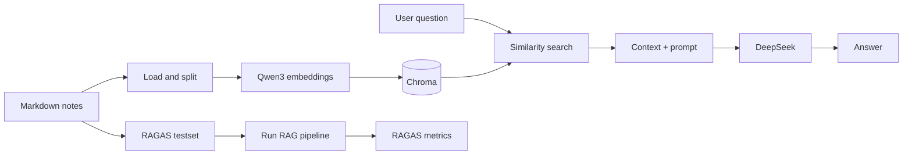

# RAG - Personal Notes Retrieval-Augmented Generation

一个面向个人 Markdown 笔记的 RAG 实验项目。项目不追求一步做成完整产品，而是从可运行的基线出发，逐步验证文档切分、向量检索、答案生成和量化评估对结果的影响。

当前已完成 Phase 0 基线，并已跑通 RAGAS 自动测试集生成与四项指标评估。后续每次策略改动都应沿用同一套测试集和评测流程，形成可比较的实验记录。

## 当前状态

| 模块 | 状态 | 当前实现 |
| --- | --- | --- |
| 文档加载 | 已完成 | 递归读取 `data/notes/` 下的 Markdown |
| 文本切分 | 已完成 | `RecursiveCharacterTextSplitter`，`chunk_size=500`、`chunk_overlap=50` |
| 向量化 | 已完成 | 本地 `Qwen3-Embedding-0.6B`，向量归一化 |
| 向量库 | 已完成 | Chroma 本地持久化 |
| 查询与生成 | 已完成 | Chroma 相似度检索 + DeepSeek OpenAI-compatible API |
| 自动测试集 | 已完成 | RAGAS 单跳问题生成，面向远程 Markdown 做了兼容处理 |
| RAGAS 评估 | 已完成 | Faithfulness、Answer Relevancy、Context Precision、Context Recall |
| 混合检索 / Reranker | 未开始 | Phase 1 优先项 |
| 结构化切分 / PDF / WebUI | 未开始 | 后续阶段 |

## 系统流程



核心查询入口是 `rag_answer(question, top_k)`，返回问题、实际检索到的上下文和答案。生成阶段的提示词要求模型只能依据检索上下文回答；缺少依据时返回固定拒答语句。

## 本次进展：RAGAS 评测链路

本次更新主要集中在 `scripts/` 与 `experiments/`：补齐了测试集生成与评测的兼容处理，并完成了一次可用的定量评估。

### 已解决的问题

- RAGAS 与新版 `langchain_community` 的 VertexAI 导入路径不兼容；项目使用临时模块兼容层绕过未使用的 VertexAI 依赖。
- 远程 Markdown 的标题结构不稳定，RAGAS 的 `HeadlineSplitter` 会因节点没有 `headlines` 属性失败。测试集生成改为在文档节点上提取主题和实体，再以主题生成单跳问题。
- DeepSeek 的 OpenAI-compatible API 仅支持 `n=1`；RAGAS 的 LangChain wrapper 启用了 `bypass_n=True`。
- 为生成和评估设置超时与并发参数，避免 API 请求长时间无反馈或失败被静默吞掉。

这些改动不改变主 RAG 查询逻辑，目标是让评测链路能够稳定地围绕当前基线运行。

### 最新评测结果

最新一次记录使用 RAGAS 自动生成的 20 条测试样本，并对 20 条 RAG 响应完成评估。

| 指标 | 平均分 | 观察 |
| --- | ---: | --- |
| Faithfulness | 0.8462 | 大多数回答有检索上下文支持，仍有约 15% 的内容存在脱离上下文的风险。 |
| Answer Relevancy | 0.7579 | 当前最需要关注的生成端指标，答案与问题的贴合度还有提升空间。 |
| Context Precision with Reference | 0.8361 | 多数检索片段有用，但仍混入部分弱相关上下文。 |
| Context Recall | 0.9333 | 当前表现最好，参考答案所需的信息大多能够被召回。 |

这些分数是当前语料、测试集和模型配置下的基线，不应与其他语料或不同测试集的分数直接比较。更重要的是：从这里开始，后续检索、切分或生成策略的调整可以用同一流程做 A/B 对比。

详细过程和终端结果见：

- `experiments/基线测试结果记录.md`
- `experiments/初期结果评估记录.md`
- `experiments/库版本冲突解决流程.md`

## 项目结构

```text
RAG/
├── config/
│   └── settings.py                 # 模型、路径、切分、检索等统一配置
├── indexing/
│   └── vectorstore.py              # Chroma 的构建与连接封装
├── scripts/
│   ├── build_vectorstore.py        # 加载 Markdown、切分、向量化、写入 Chroma
│   ├── RAG_pipeline.py             # retrieve / generate / rag_answer
│   ├── TestsetGenerator.py         # RAGAS 自动生成测试集
│   ├── evalute.py                  # RAGAS 定量评估
│   └── test/                       # Embedding、LLM、chunk 与冒烟测试
├── experiments/                    # 实验现象、问题与结果记录
├── output/                         # testset.csv 与 eval_result.csv
├── data/                           # 本地 Markdown / PDF，默认不提交
└── chroma_db/                      # 本地 Chroma 数据，默认不提交
```

## 环境准备

要求：Python 3.10+、DeepSeek API Key；构建索引和查询均可使用 CPU，但本地 Embedding 在 CUDA 环境下更适合较大语料。

当前依赖尚未完全固化到 `pyproject.toml`。可先安装：

```bash
pip install langchain langchain-community langchain-text-splitters \
  langchain-huggingface langchain-chroma langchain-openai \
  openai ragas pandas tqdm torch pydantic-settings python-dotenv
```

创建 `.env`：

```bash
cp .env.example .env
```

```env
DEEPSEEK_API_KEY=sk-your-key
DEEPSEEK_BASE_URL=https://api.deepseek.com
```

本地 Embedding 模型默认路径为项目同级目录的 `Pre_Models/Qwen3-Embedding-0.6B`，可在 `config/settings.py` 中调整。

把 Markdown 笔记放在 `data/notes/`。该目录、Chroma 数据和本地模型均不随 Git 同步，因此远程服务器需要自行准备相同的数据与模型。

## 常用命令

```bash
# 验证本地 Embedding 的维度与基础语义相似度
python scripts/test/test_embedding.py

# 验证 DeepSeek API 连通性
python scripts/test/test_llm.py

# 构建或重建 Chroma 索引
python scripts/build_vectorstore.py

# 查看 chunk 质量并执行基线冒烟测试
python scripts/test/test_chunk_size.py

# 单次查询 / 交互式验证 RAG 主链路
python scripts/RAG_pipeline.py

# 生成 RAGAS 测试集
python scripts/TestsetGenerator.py

# 运行 RAGAS 评估并写入 output/eval_result.csv
python scripts/evalute.py
```

当 `data/notes/` 有新增或修改时，先重建索引，再生成测试集或执行评测。为了让对比有效，策略实验期间应固定一份测试集；只有语料范围明显变化时再重新生成测试集。

## 当前基线配置

配置集中在 `config/settings.py`，便于后续 A/B 实验尽量只改参数、不改主流程。

```python
llm_model = "deepseek-v4-flash"
embedding_model = "../Pre_Models/Qwen3-Embedding-0.6B"
chunk_size = 500
chunk_overlap = 50
retrieval_top_k = 4
llm_temperature = 0.0
```

已完成的局部验证包括：

- Embedding 输出 1024 维向量；语义相近示例相似度为 0.8700，语义无关示例为 0.3364。
- 单文档基线冒烟测试通过。
- 7 篇 Markdown 的 chunk 分析得到 102 个 chunk，平均长度 377.7，最大 494，最小 3。

## 已知限制

- 固定长度切分会产生极短 chunk，并可能切断标题、段落、代码块或指代关系。
- 当前仅使用纯向量相似度检索。随着语料扩大，已观察到 RAG 问题可能召回 Transformer 等语义接近但任务无关的内容。
- `RAG_pipeline.py` 当前固定使用 CUDA；而索引脚本会自动选择 CUDA/CPU，两者还没有统一。
- RAGAS 的 LangChain wrapper 仍会给出弃用提示。当前兼容层能运行，但依赖版本需要在后续整理并锁定。
- 自动生成的问题可能有错别字、覆盖不均等问题；用于趋势比较前应抽样审阅测试集质量。
- PDF 目录已预留，但尚未进入加载、切分和索引流程。

## 下一步实验路线

1. 检索优化：引入 BM25，与向量召回做混合检索，并加入 Reranker。重点观察 Context Precision 和 Answer Relevancy 是否提升。
2. 切分优化：按 Markdown 标题和段落结构切分，保留标题上下文，比较极短 chunk 数量与 RAGAS 指标变化。
3. 可追溯性：把来源文件、标题和片段位置写入 metadata，并在答案中返回来源。
4. 工程化：统一 CPU/CUDA 设备选择，锁定依赖版本，移除临时兼容代码。
5. 扩展输入：接入 PDF，保留页码和来源信息。
6. 交互入口：使用 Streamlit 或 Gradio 展示问题、检索上下文、回答与评测结果。

## 学习日志维护方式

每完成一次实验，在 `experiments/` 新增或更新记录，并同步更新下面的条目：

```markdown
### YYYY-MM-DD - 实验名称
- 目标：
- 改动：
- 数据与测试集：
- 结果：
- 结论：
- 下一步：
```

| 日期 | 阶段 | 进展 |
| --- | --- | --- |
| 2026-07 | Phase 0 | 跑通 Markdown -> Chroma -> 检索 -> DeepSeek 生成的基线链路。 |
| 2026-07 | 评测基础设施 | 解决 RAGAS / LangChain 兼容、远程 Markdown 标题与 DeepSeek `n=1` 限制，生成 20 条测试集并完成四项指标评估。 |
| 下一阶段 | Phase 1 | 以当前 RAGAS 分数为对照，优先验证混合检索、重排与结构化切分。 |

## 结论

项目现在具备了“可运行、可观测、可评估”的最小闭环。当前最有价值的工作不是立刻扩展界面或输入格式，而是先用已有 RAGAS 基线验证检索质量改进：让召回的上下文更相关，再观察生成答案是否随之更贴近问题、更加忠实于资料。
