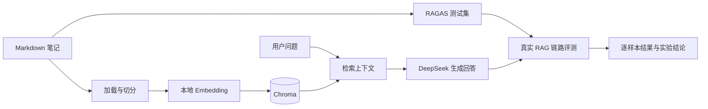
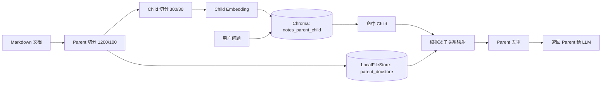

# Personal Notes RAG

一个面向个人 Markdown 笔记的本地检索增强生成（Retrieval-Augmented Generation，RAG）实验项目。

本项目的重点不是快速搭建一个问答界面，而是建立一套**可运行、可评测、可对照、可复盘**的 RAG 实验流程：先构建稳定的向量检索基线，再固定评测集，在尽量保持其他条件不变的前提下，对混合检索、父子分块等策略进行单变量实验。

> 项目仍在持续学习和迭代中。README 只描述当前已经实现或已经完成验证的能力；尚未完成的方向请参见 [`docs/ROADMAP.md`](docs/ROADMAP.md)。

---

## 项目目标

- 将个人 Markdown 笔记构建为可持久化的本地知识库。
- 使用本地 Embedding 模型完成语义检索。
- 使用 DeepSeek 的 OpenAI-compatible API，结合检索上下文生成回答。
- 使用 RAGAS 生成并固定测试集，分别评估检索端和生成端。
- 在相同语料、测试集、模型与参数条件下，对不同检索策略进行 A/B 对照。
- 保存测试集、逐样本结果、实验日志和问题排查过程，使每个结论都能够回到对应证据。

## 项目特点

- **本地 Embedding**：笔记向量化过程在本地完成。
- **多种检索策略**：已实现纯向量检索、中文 BM25 混合检索和父子分块检索。
- **真实链路评测**：评测脚本直接调用实际的 `rag_answer()`，而不是使用独立模拟结果。
- **检索与生成分开度量**：同时关注 Faithfulness、Answer Relevancy、Context Precision 和 Context Recall。
- **实验结果可追踪**：保留固定测试集、逐样本 CSV、终端输出和阶段性分析。
- **面向研究而非 Demo**：重点关注策略是否真正有效，以及改进是否能够被复现。

---

## 当前状态

| 能力 | 状态 | 说明 |
| --- | --- | --- |
| Markdown → Chroma 向量库 | 已完成 | 固定长度切分、本地 Embedding、持久化向量存储 |
| 向量检索 + DeepSeek 回答 | 已完成 | `rag_answer()` 的默认检索方式，也是后续实验的稳定基线 |
| RAGAS 测试集生成与四项指标评测 | 已完成 | 测试集、逐样本结果和排错过程均已保留 |
| 中文 BM25 + 混合检索 | 已实现并完成对照 | 已加入 `jieba` 中文分词；当前小规模语料下未形成稳定的综合优势 |
| 父子分块检索 | 已实现并完成对照 | 使用小型 child chunk 检索，返回所属 parent chunk；当前综合实验表现最好 |
| Prompt 生成约束实验 | 已实现 | 目标是改善 Faithfulness、Answer Relevancy 和拒答行为 |
| PDF、Rerank、元数据过滤、来源引用 | 规划中 | 具体方向与验收条件见路线图 |

### 当前推荐方式

- **实验基线**：纯向量检索。结构简单、运行稳定，适合作为其他策略的对照组。
- **当前最佳实验策略**：父子分块检索。在现有固定测试集上取得了最高的 Answer Relevancy、Context Precision 和 Context Recall。
- **暂不作为默认策略**：混合检索。它能够增强词面召回，但在当前语料规模和问题类型下会引入额外噪声。

这里的“最佳”只表示当前语料、20 条合成测试样本、模型和参数组合下的结果，不代表通用结论。

---

## 为什么需要实验闭环

RAG 的回答“看起来不错”并不意味着系统真正变好了。一次修改可能提高某个问题的回答质量，却同时降低整体召回率、引入无关上下文，或者显著增加 Token 消耗。

因此，本项目将工作拆分为三条相互依赖的链路：

1. **建库与生成链路**：构建最小可用的 RAG 基线。
2. **测试集与评测链路**：使用固定测试集统一度量真实 RAG 输出。
3. **检索优化对照链路**：在控制非目标变量的条件下比较候选策略。


```mermaid
flowchart LR
    A[Markdown 笔记] --> B[加载与切分]
    B --> C[本地 Embedding]
    C --> D[(Chroma)]

    Q[用户问题] --> R[检索上下文]
    D --> R
    R --> G[DeepSeek 生成回答]

    A --> T[RAGAS 测试集]
    T --> E[真实 RAG 链路评测]
    G --> E
    E --> X[逐样本结果与实验结论]
```

---

## 系统架构

### 1. 基础向量建库

```text
Markdown documents
  → DirectoryLoader
  → RecursiveCharacterTextSplitter
  → Qwen3-Embedding-0.6B
  → Chroma
```

当前基线配置包括：

- 基线切分：`chunk_size=500`、`chunk_overlap=50`
- 默认检索数量：`top_k=4`
- Embedding：本地 `Qwen3-Embedding-0.6B`
- 生成模型：DeepSeek OpenAI-compatible API

基础建库脚本 [`scripts/build_vectorstore.py`](scripts/build_vectorstore.py) 会生成：

- `chroma_db/`：Chroma 持久化目录；
- `output/all_chunks.pkl`：与向量库对应的 chunk 快照，供 BM25 混合检索使用。

### 2. RAG 问答主链路

[`scripts/RAG_pipeline.py`](scripts/RAG_pipeline.py) 是当前实际查询入口：

```text
question
  → retrieve contexts
  → assemble prompt
  → DeepSeek response
```

核心函数：

```python
rag_answer(
    question,
    top_k=None,
    use_hybrid=False,
    all_chunks=None,
    vector_weight=0.5,
    bm25_weight=0.5,
    use_parent_child=False,
)
```

返回结构：

```python
{
    "question": "用户问题",
    "retrieved_contexts": ["实际召回上下文"],
    "answer": "模型回答",
    "response": "模型回答",
}
```

评测阶段直接使用该函数返回的真实检索上下文和回答，因此评测对象与实际查询链路保持一致。

### 3. 测试集与评测

[`scripts/TestsetGenerator.py`](scripts/TestsetGenerator.py) 使用 RAGAS 从 Markdown 笔记中生成：

- 用户问题；
- 参考上下文；
- 参考答案。

[`scripts/evalute.py`](scripts/evalute.py) 会逐条调用 `rag_answer()`，再计算：

| 指标 | 主要评估对象 | 含义 |
| --- | --- | --- |
| Faithfulness | 生成端 | 回答中的内容是否能够被检索上下文支持 |
| Answer Relevancy | 生成端 | 回答是否直接回应用户问题 |
| LLM Context Precision with Reference | 检索端 | 召回内容中真正有用信息的比例 |
| Context Recall | 检索端 | 参考答案需要的信息是否被完整召回 |

评测输出保存在 `output/`，其中包含每条问题的实际上下文、模型回答、参考答案和各项得分，便于定位失败案例。

---

## 检索策略

### 1. 纯向量检索

纯向量检索直接在基线 Chroma Collection 中执行相似度搜索：

```text
question
  → question embedding
  → Chroma similarity search
  → top-k chunks
  → LLM
```

优点：

- 实现简单；
- 运行稳定；
- 延迟和上下文长度相对可控；
- 适合作为其他策略的实验基线。

局限：

- 固定长度 chunk 可能截断跨段语义；
- 较小 chunk 有利于检索匹配，但可能无法向生成模型提供完整上下文；
- 较大 chunk 上下文更完整，但向量语义可能被无关内容稀释。

### 2. 中文 BM25 + 向量混合检索

混合检索将向量语义召回与 BM25 关键词召回进行融合。

```text
                    ┌→ Vector Retriever ─┐
question ───────────┤                    ├→ RRF Fusion → top-k chunks
                    └→ BM25 Retriever ───┘
```

中文 BM25 不能直接依赖空格分词。本项目使用 `jieba` 对中文内容进行分词，否则较长的中文句子可能被近似视为单个 token，导致关键词检索失效。

当前实验表明，混合检索可以提高部分词面查询的召回能力，但在现有小规模、跨主题笔记语料中也会引入噪声，因此暂不作为默认策略。

### 3. 父子分块检索

父子分块用于缓解“小块便于检索”和“大块便于生成”之间的矛盾。

当前参数：

| 层级 | Chunk Size | Chunk Overlap | 用途 |
| --- | ---: | ---: | --- |
| Parent | 1200 | 100 | 保留较完整的上下文，最终返回给 LLM |
| Child | 300 | 30 | 用于向量匹配，提高检索粒度 |

实际流程：


```mermaid
flowchart LR
    A[Markdown 文档] --> B[Parent 切分 1200/100]
    B --> C[Child 切分 300/30]
    C --> D[Child Embedding]
    D --> E[(Chroma: notes_parent_child)]
    B --> F[(LocalFileStore: parent_docstore)]

    Q[用户问题] --> E
    E --> G[命中 Child]
    G --> H[根据父子关系映射]
    F --> H
    H --> I[Parent 去重]
    I --> J[返回 Parent 给 LLM]
```

对应实现位于 [`scripts/build_parent_children_index.py`](scripts/build_parent_children_index.py)：

- child 向量存入独立 Collection：`notes_parent_child`；
- 不覆盖基线使用的 Collection，便于 A/B 对比；
- parent 原文通过 `LocalFileStore` 持久化到 `output/parent_docstore/`；
- 查询阶段使用 LangChain `ParentDocumentRetriever` 完成“检索 child、返回 parent”。

#### 为什么 child 检索数量大于最终 top_k

多个高相关 child 可能属于同一个 parent。映射并去重之后，最终 parent 数量可能小于 child 数量。

当前代码设置：

```python
child_search_k = 10
retrieval_top_k = 4
```

即先召回更多 child 候选，再映射和去重，最后最多返回 `top_k` 个 parent。即使如此，当多个 child 集中来自少量 parent 时，最终返回数量仍可能少于 `top_k`，这是父子分块检索的正常现象。

### 三种策略对比

| 模式 | 实际索引对象 | 返回给 LLM | 主要优点 | 当前结论 |
| --- | --- | --- | --- | --- |
| Vector | 固定长度 chunk | 原 chunk | 简单、稳定、成本较低 | 推荐作为实验基线 |
| Hybrid | Vector chunk + BM25 chunk | 融合后的 chunk | 同时覆盖语义和关键词 | 当前语料下未形成稳定综合优势 |
| Parent-child | 较小 child chunk | 对应的较大 parent chunk | 检索精细、上下文完整 | 当前综合实验表现最好 |

---

## 已验证结果

当前结果基于固定的 **20 条 RAGAS 合成测试样本**。所有数字只适用于当前语料、测试集、Embedding、生成模型、评测模型和参数配置。

| 指标 | Vector Baseline | Hybrid 0.5/0.5 | Hybrid 0.7/0.3 | Parent-child | structred_prompt |
| --- | ---: | ---: | ---: | ---: | ---: |
| Faithfulness | 0.8172 | 0.8137 | 0.8375 | 0.8305 | **0.8922** |
| Answer Relevancy | 0.7979 | 0.7714 | 0.7374 | **0.8020** | 0.7439 |
| Context Precision | 0.8444 | 0.8788 | 0.8640 | **0.9737** | **0.9737** |
| Context Recall | 0.9500 | 0.9298 | 0.9333 | **1.0000** | 0.9900 |

### 结果解读

#### 向量基线

纯向量检索在四项指标上较为均衡，适合作为后续实验的稳定参照。对应逐样本结果：

```text
output/eval_result_baseline.csv
```

#### 混合检索

混合检索在部分配置下提高了 Faithfulness 或 Context Precision，但 Answer Relevancy 和 Context Recall 没有同步改善，说明额外的词面召回也可能将噪声带入生成上下文。

当前语料规模较小、文档主题较分散，许多问题能够由单个主题文档回答，纯向量检索已经具备较强的语义召回能力。混合检索更适合在以下条件下重新验证：

- 语料规模继续扩大；
- 同领域文档重叠增加；
- 出现更多专有名词、编号、报错信息和精确术语查询；
- 需要同时覆盖语义相似和关键词精确匹配。

#### 父子分块

父子分块取得了最高的：

- Context Precision：`0.9737`
- Context Recall：`1.0000`

其 Faithfulness 为 `0.8305`，高于纯向量基线，但略低于 0.7/0.3 的混合检索。

当前结果说明，“使用小块进行匹配、向生成模型返回更完整的大块上下文”能够明显改善检索上下文的完整性和有效信息比例，并可能进一步改善生成回答的相关性。

不过，父子分块通常会返回更长的上下文。后续还需要同时记录：

- 平均召回字符数和 Token 数；
- 检索延迟；
- 端到端响应时间；
- 单问题生成成本；
- P50/P95 延迟；
- 人工评审结果。

只有结合质量、延迟和成本，才能判断它是否适合作为长期默认策略。

详细实验过程见：

```text
experiments/parent_child_chunk检索结果记录.md
```

#### 结构化生成优化
结构化生成目前取得了最好faithfilness的和次好的context recall：
- Faithfulness: 0.8922
- Context Recall: 0.9900

从目前的结果显示，`faithfulness`是目前几轮评估中最高的，引用的资料是可信的——结构化输出在这方面是增加了可信度的；

```text
experiments/结构化生成优化结果记录.md
```


---

## 项目目录

```text
RAG/
├── config/
│   └── settings.py                    # 模型、路径、切分与检索配置
├── indexing/
│   └── vectorstore.py                 # 基线 Chroma 构建与读取封装
├── scripts/
│   ├── test/                          # Embedding、LLM、chunk 与链路冒烟测试
│   ├── build_vectorstore.py           # 构建纯向量基线索引
│   ├── build_parent_children_index.py # 构建父子分块索引与 parent docstore
│   ├── RAG_pipeline.py                # 检索、Prompt 拼接与答案生成
│   ├── TestsetGenerator.py            # 使用 RAGAS 生成测试集
│   ├── evalute.py                     # 运行真实 RAG 链路并使用 RAGAS 评测
│   └── hybrid_search_optimize.py      # 中文 BM25 与向量混合检索
├── experiments/                       # 终端输出、排错过程和实验记录
├── output/
│   ├── testset.csv                    # 固定测试集
│   ├── all_chunks.pkl                 # BM25 使用的 chunk 快照
│   ├── parent_docstore/               # 父子分块的 parent 原文存储
│   └── eval_result_*.csv              # 各策略逐样本评测结果
├── docs/
│   ├── ROADMAP.md                     # 下一阶段任务与验收条件
│   └── RESULTS.md                     # 已验证结果索引
├── data/
│   └── notes/                         # 本地 Markdown 笔记，默认不提交
├── chroma_db/                         # Chroma 持久化目录，默认不提交
├── .env.example
└── README.md
```

> 当前仓库中的 `evalute.py` 和部分 `hybird` 变量名保留了早期拼写。后续建议统一重命名为 `evaluate.py` 和 `hybrid`；在完成代码重命名前，请以仓库中的实际文件名和变量名为准。

---

## 快速开始

### 1. 环境要求

- Python 3.10+
- DeepSeek API Key
- 本地 `Qwen3-Embedding-0.6B` 模型文件
- CUDA 可选，但当前部分脚本仍将设备硬编码为 `cuda`

若没有 GPU，请将以下文件中的设备配置改为 `cpu`：

```python
model_kwargs={"device": "cpu"}
```

涉及文件：

- `scripts/RAG_pipeline.py`
- `scripts/build_parent_children_index.py`

长期建议将设备配置移动到 `config/settings.py`，或者通过 `torch.cuda.is_available()` 自动选择。

### 2. 安装依赖

当前依赖版本仍在整理和锁定中，可先安装运行链路所需依赖：

```bash
pip install \
  langchain \
  langchain-community \
  langchain-classic \
  langchain-text-splitters \
  langchain-huggingface \
  langchain-chroma \
  langchain-openai \
  openai \
  ragas \
  pandas \
  tqdm \
  torch \
  pydantic-settings \
  python-dotenv \
  jieba
```

> 评测脚本中暂时包含一个 RAGAS 与新版 `langchain-community` 的兼容补丁。为了保证外部复现，后续应补充并锁定 `requirements.txt` 或 `pyproject.toml` 中的已验证版本。

### 3. 配置环境变量

复制环境变量模板：

```bash
cp .env.example .env
```

填写 DeepSeek 配置：

```env
DEEPSEEK_API_KEY=sk-your-key
DEEPSEEK_BASE_URL=https://api.deepseek.com
```

其他模型名称、温度、路径和检索参数以 [`config/settings.py`](config/settings.py) 为准。

### 4. 准备本地模型和笔记

将 Embedding 模型放置在：

```text
Pre_Models/Qwen3-Embedding-0.6B
```

也可以直接修改 `config/settings.py` 中的 `embedding_model` 路径。

将待检索的 UTF-8 Markdown 文件放入：

```text
data/notes/
```

### 5. 基础环境检查

```bash
python scripts/test/test_embedding.py
python scripts/test/test_llm.py
```

### 6. 构建纯向量基线

```bash
python scripts/build_vectorstore.py
```

该步骤会构建基线 Chroma Collection，并生成混合检索需要的 `output/all_chunks.pkl`。

### 7. 构建父子分块索引

仅使用纯向量或混合检索时可以跳过此步骤。使用父子分块前必须先执行：

```bash
python scripts/build_parent_children_index.py
```

预期输出包括：

```text
索引建立完成，collection=notes_parent_child
父块原文已持久化到: .../output/parent_docstore
```

> 当前构建脚本不会自动清理旧的 `notes_parent_child` Collection 和 `parent_docstore`。当语料、Embedding 模型或父子切分参数发生变化时，应先清理旧父子索引再重新构建，避免新旧数据混合。不要在需要保留向量基线时直接删除整个 `chroma_db/`。

### 8. 验证问答链路

```bash
python scripts/RAG_pipeline.py
```

当前脚本会针对一个示例问题，分别打印纯向量检索和父子分块检索返回的上下文，便于观察两种切分策略的差异。

### 9. 生成固定测试集

```bash
python scripts/TestsetGenerator.py
```

> 当前版本的 `TestsetGenerator.py` 曾存在未解决的 Git 冲突标记。执行前请先确认文件中不存在 `<<<<<<<`、`=======`、`>>>>>>>` 等冲突内容。已经保存的 `output/testset.csv` 可以直接用于后续评测。

### 10. 选择评测模式

当前 [`scripts/evalute.py`](scripts/evalute.py) 通过文件顶部的常量切换策略：

```python
USE_HYBIRD = False
USE_PARENT_CHILD = True
VECTOR_WEIGHT = 0.7
BM25_WEIGHT = 0.3
```

对应关系：

| 评测模式 | `USE_PARENT_CHILD` | `USE_HYBIRD` |
| --- | :---: | :---: |
| 纯向量基线 | `False` | `False` |
| 混合检索 | `False` | `True` |
| 父子分块 | `True` | `False` |

当两个开关同时为 `True` 时，当前实现会优先执行父子分块，因此不建议同时开启。

修改配置后运行：

```bash
python scripts/evalute.py
```

输出文件示例：

```text
output/eval_result_baseline.csv
output/eval_result_hybird_v0.7_b0.3.csv
output/eval_result_parent_child.csv
```

长期建议将两个布尔开关改为单一模式参数，例如：

```text
retrieval_mode = vector | hybrid | parent_child
```

并通过命令行参数运行，避免每次评测都修改源代码。

---

## 实验复现原则

当笔记内容、切分策略、Embedding 模型或索引结构发生变化时，需要重新建库。

进行策略对照时，应固定以下非目标变量：

- 原始语料版本；
- 测试集版本；
- Embedding 模型；
- 生成模型；
- 评测模型；
- Prompt；
- 温度；
- `top_k`；
- RAGAS 指标和运行参数。

每次实验尽量只改变一个关键变量，并在 [`experiments/`](experiments/) 中记录：

- 实验目标；
- 实验假设；
- 唯一变量；
- 固定条件；
- 语料与测试集版本；
- 指标结果；
- 运行时间；
- Token 或成本数据；
- 典型成功和失败案例；
- 实验结论；
- 下一步是否值得继续投入。

推荐记录模板：

```markdown
### YYYY-MM-DD - experiment-id

- 目标：
- 假设：
- 唯一变量：
- 固定条件：
- 数据与测试集版本：
- 指标结果：
- 延迟与成本：
- 典型成功案例：
- 典型失败案例：
- 结论：
- 下一步：
```

---

## 常见问题

### 1. 为什么父子分块最终返回的文档少于 top_k？

多个 child 可能属于同一个 parent。映射到 parent 后会执行去重，因此最终 parent 数量可能少于 child 数量，也可能少于设定的 `top_k`。

可以适当增大 `child_search_k`，但该参数越大，检索开销和候选噪声也可能增加，需要通过固定测试集验证。

### 2. 为什么找不到 `all_chunks.pkl`？

`all_chunks.pkl` 由基础向量建库流程生成，主要供 BM25 使用。先运行：

```bash
python scripts/build_vectorstore.py
```

### 3. 为什么父子分块查询没有结果？

确认已经执行：

```bash
python scripts/build_parent_children_index.py
```

并检查以下内容是否存在：

- Chroma Collection：`notes_parent_child`
- Parent 存储目录：`output/parent_docstore/`

### 4. 为什么 CPU 环境运行失败？

当前部分脚本仍使用：

```python
model_kwargs={"device": "cuda"}
```

没有 CUDA 时需要改成 `cpu`。

### 5. 为什么 RAGAS 导入 VertexAI 时报错？

当前评测脚本包含一个只用于绕过无关 VertexAI 导入的临时兼容补丁。项目实际没有使用 VertexAI。后续会通过依赖版本锁定或升级 RAGAS 移除该补丁。

---

## 当前限制

- 本地语料、Embedding 模型和 Chroma 数据库不随 Git 同步，外部开发者可以复现流程，但无法直接复现仓库作者当前机器上的精确分数。
- 当前评测集只有 20 条 RAGAS 合成样本，适合验证实验闭环和早期策略，不足以支撑泛化结论。
- 测试集与知识库来自同一批笔记，仍需要补充人工问题、边界问题和知识库外问题。
- 向量基线仍使用固定字符长度切分，可能破坏 Markdown 标题层级、列表、表格、代码块和跨段上下文。
- 父子分块缓解了上下文截断，但 parent 和 child 当前仍然是字符长度切分，并不理解 Markdown 结构。
- 当前代码在部分文件中硬编码 `cuda`，CPU/GPU 设备选择尚未统一配置。
- 父子索引构建脚本尚未提供安全的自动清理和幂等重建机制。
- 评测模式仍通过源码中的布尔变量切换，尚未提供统一的命令行接口。
- RAGAS 与 LangChain 依赖仍有兼容补丁和弃用警告，尚未完成完整版本锁定。
- 当前生成模型与评测裁判均使用 DeepSeek 配置，可能存在同源模型自评偏差，需要补充异构评测模型和人工抽检。
- 当前实验尚未系统记录 Token、延迟和 API 成本，无法仅依据质量指标确定最终默认策略。
- PDF 加载、来源页码引用、Rerank、元数据过滤、增量索引和服务化接口仍处于路线图阶段。

---

## Roadmap

近期优先级：

1. 统一 `evalute/evaluate`、`hybird/hybrid` 和父子分块文件命名。
2. 将设备、父子切分参数、检索模式和权重移动到统一配置。
3. 增加命令行参数，例如 `--retriever vector|hybrid|parent-child`。
4. 为索引构建增加清理、重建和重复执行保护。
5. 锁定并验证 Python、LangChain、RAGAS 和 Chroma 依赖版本。
6. 扩展测试集，增加人工问题、知识库外问题和多跳问题。
7. 记录检索延迟、端到端耗时、上下文 Token 和 API 成本。
8. 实现 Markdown 结构感知切分，并与字符切分进行对照。
9. 实现 Rerank、元数据过滤和来源引用。
10. 增加 PDF 解析、页码追踪和统一文档元数据。

完整规划与验收标准请参见 [`docs/ROADMAP.md`](docs/ROADMAP.md)。

---

## 文档与证据

- [`docs/ROADMAP.md`](docs/ROADMAP.md)：下一阶段计划、候选实验和验收标准。
- [`docs/RESULTS.md`](docs/RESULTS.md)：已验证实验的结果索引。
- [`experiments/`](experiments/)：完整终端输出、异常定位和阶段性观察。
- [`output/`](output/)：固定测试集、chunk 快照和逐样本评测 CSV。

---

## 贡献

欢迎围绕文档切分、检索策略、评测设计、实验复现和工程结构提交建议或改进。

提交 Issue 或 Pull Request 时，请尽量说明：

- 改动解决的问题；
- 使用的语料范围；
- 测试集版本；
- 修改的唯一变量；
- 保持不变的对照条件；
- 对四项 RAGAS 指标的影响；
- 对典型成功和失败案例的影响；
- 对延迟、Token 和成本的影响；
- 是否需要重新构建索引。

---

## License

本仓库目前尚未添加正式开源许可证。

在公开复用、修改、分发或接受外部贡献前，应补充明确的 `LICENSE` 文件，例如 MIT License。许可证正式加入仓库后，请同步更新本节。
