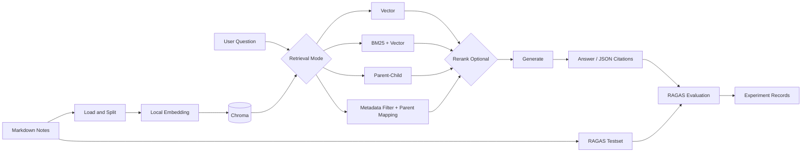

# Personal Notes RAG

一个面向个人 Markdown 笔记的本地 RAG 实验项目。

这个仓库的重点不是快速搭建问答界面，而是记录一条可运行、可评测、可对照、可复盘的 RAG 实践路径：从向量检索基线出发，逐步验证混合检索、父子分块、结构化生成、元数据检索与 Rerank 精排，并保留每一步的实验记录与反例。

> 本项目仍在迭代。README 只描述已实现和已验证的工作；详细过程见 [`experiments/`](experiments/)，后续计划见 [`docs/ROADMAP.md`](docs/ROADMAP.md)。

## 项目目标

- 将个人 Markdown 笔记构建为可持久化、可检索的本地知识库。
- 使用本地 `Qwen3-Embedding-0.6B` 完成向量化，使用 Chroma 持久化索引。
- 使用 DeepSeek 的 OpenAI-compatible API，基于检索上下文生成回答。
- 使用 RAGAS 生成测试集，并同时衡量检索与生成质量。
- 用尽量严格的单变量对照，判断一个优化是否真实有效，而非只凭个别回答判断。

## 已完成能力

| 模块 | 已完成工作 | 当前结论 |
| --- | --- | --- |
| 基线 | 固定长度切分、向量检索、DeepSeek 生成 | 作为所有策略的对照组 |
| 评测 | RAGAS 测试集、四项核心指标、逐样本结果保存 | 已形成端到端评测闭环 |
| 混合检索 | `jieba` 中文 BM25 与向量检索 RRF 融合 | 当前小规模跨主题语料中未形成稳定综合优势 |
| 父子分块 | 小 child 检索、大 parent 返回 | 明显改善上下文 Precision 与 Recall |
| 结构化生成 | JSON 输出、回答性判断、引用编号与本地校验 | 提升回答可核查性，并改善 Faithfulness |
| 元数据检索 | 自动主题标签、修改日期、SelfQueryRetriever 过滤 | 与父子分块结合后取得当前最佳 Faithfulness 与 Precision |
| 查询改写 | MultiQueryRetriever 生成多视角查询 | 当前小语料下未观察到稳定增益，保留为候选策略 |
| Rerank 精排 | Cross-Encoder（`bge-reranker-base`）对候选二次打分 | 叠加在当前最佳组合上未带来提升，判定为负例，见下文分析 |

## 系统流程


```mermaid
flowchart LR
    A[Markdown Notes] --> B[Load and Split]
    B --> C[Local Embedding]
    C --> D[(Chroma)]

    Q[User Question] --> M{Retrieval Mode}
    D --> M
    M --> V[Vector]
    M --> H[BM25 + Vector]
    M --> P[Parent-Child]
    M --> S[Metadata Filter + Parent Mapping]
    V --> RR{Rerank Optional}
    H --> RR
    P --> RR
    S --> RR
    RR --> G[Generate]
    G --> O[Answer / JSON Citations]

    A --> T[RAGAS Testset]
    O --> E[RAGAS Evaluation]
    T --> E
    E --> R[Experiment Records]
```

## 核心实现

### 基线：向量检索与生成

```text
Markdown
  -> DirectoryLoader
  -> RecursiveCharacterTextSplitter (500 / 50)
  -> Qwen3-Embedding-0.6B
  -> Chroma
  -> similarity search (top_k=4)
  -> DeepSeek
```

[`scripts/build_vectorstore.py`](scripts/build_vectorstore.py) 负责加载笔记、切分、建立 Chroma 基线索引，并保存同批 chunk 快照，供 BM25 实验复用。[`scripts/RAG_pipeline.py`](scripts/RAG_pipeline.py) 提供统一的 `rag_answer()` 入口，返回实际检索上下文与最终回答。

### 父子分块

父子分块用于化解“小块更容易检索”和“大块更适合生成”之间的矛盾：

| 层级 | 参数 | 用途 |
| --- | ---: | --- |
| Parent | `1200 / 100` | 保留较完整的上下文，返回给 LLM |
| Child | `300 / 30` | 建立向量索引，完成细粒度匹配 |

查询时先命中 child chunk，再通过 `ParentDocumentRetriever` 映射、去重并返回对应 parent。child 向量存储在独立的 `notes_parent_child` collection，parent 原文持久化到本地 docstore，不覆盖基线 collection。

### 结构化生成与引用校验

[`scripts/structured_generate.py`](scripts/structured_generate.py) 要求模型以 JSON 输出：

```json
{
  "answer": "基于检索资料生成的回答",
  "cited_indices": [1, 3],
  "is_answerable": true
}
```

系统会校验引用编号是否在本次检索上下文的有效范围内，同时记录 JSON 解析失败率。这个校验只能证明“编号合法”，不能单独证明每句话都被资料支持；回答事实性仍由 RAGAS Faithfulness 和人工抽查共同判断。

### 元数据检索

[`scripts/check_auto_tag_notes.py`](scripts/check_auto_tag_notes.py) 使用 LLM 为每篇笔记生成：

- `primary_tag`：用于主题过滤的主标签；
- `modified_date`：笔记最后修改日期；
- `tags`：辅助人工检查的标签集合。

随后在构建父子分块索引时将 `primary_tag` 与 `modified_date` 写入每个 chunk 的 metadata。[`scripts/self_query_retriever.py`](scripts/self_query_retriever.py) 使用 `SelfQueryRetriever` 将自然语言中的主题或日期限制转换为 Chroma 过滤条件；过滤得到的 child 会再次映射回 parent，以避免只向模型提供碎片化上下文。

### Rerank 精排（负例）

[`scripts/rerank.py`](scripts/rerank.py) 在任意检索模式返回结果之后，提供一个可选的二次精排步骤：粗排阶段多召回候选（`top_k=10`），再用本地 Cross-Encoder（`BAAI/bge-reranker-base`）对每一对“问题 + 候选文本”单独打分，取分数最高的 `top_k` 个返回。模型统一存放于本地指定目录（首次运行自动下载，此后直接从本地加载，不发起网络请求），避免每次调用重复下载。

设计上 Rerank 与前面四种检索模式正交，可以叠加在任意一种模式之上。实际叠加在当前最佳组合（元数据过滤 + parent 映射 + 结构化生成）上评测后，四项 RAGAS 指标均未提升，判定为负例。分析见下文“结论与反例”。

## 实验结果

下表来自同一份包含 **20 条 RAGAS 合成样本**的评测集。数值只说明当前语料、模型、Prompt、评测模型与参数下的结果，不构成通用性能声明。

| 指标 | Vector Baseline | Hybrid 0.7 / 0.3 | Parent-Child | Parent-Child + Structured | Metadata + Parent-Child + Structured | + Rerank |
| --- | ---: | ---: | ---: | ---: | ---: | ---: |
| Faithfulness | 0.8172 | 0.8375 | 0.8305 | 0.8922 | **0.9215** | 0.8981 |
| Answer Relevancy | 0.7979 | 0.7374 | **0.8020** | 0.7439 | 0.7890 | 0.7606 |
| Context Precision | 0.8444 | 0.8640 | 0.9737 | 0.9737 | **0.9792** | 0.8905 |
| Context Recall | 0.9500 | 0.9333 | **1.0000** | 0.9900 | 0.9567 | 0.9500 |

当前最佳组合（Metadata + Parent-Child + Structured，不含 Rerank）还得到以下自定义结构化输出统计：

- 引用编号有效率：`1.0000`
- JSON 解析失败率：`0.0000`
- 被模型判定为可回答：`20 / 20`

### 结论与反例

- **混合检索不是默认答案。** 修复中文 BM25 分词后，词面检索可以工作；但在当前约 22 篇、主题较分散的笔记中，额外召回也会带来噪声，Answer Relevancy 与 Recall 没有同步提升。
- **父子分块改善检索质量。** 它在 Context Precision 和 Context Recall 上提升明显，说明“child 命中、parent 返回”能同时保留匹配精度与生成所需上下文。
- **结构化输出提升可核查性。** Parent-Child + Structured 将 Faithfulness 提升到 `0.8922`，但 Answer Relevancy 有下降，说明格式约束并不会自动解决回答是否直达问题。
- **元数据过滤不能只返回 child。** Self-query 直接返回经过滤的碎片 chunk 时，四项 RAGAS 指标显著下降；将其与 parent 映射组合后，Faithfulness 和 Context Precision 达到当前最高。这是本项目最重要的一次负例到改进的闭环。
- **查询改写已经验证链路，但尚未验证收益。** 当前语料规模较小、主题集中，改写后往往仍命中相同 parent；未来在更大、主题重叠更多的语料上应重新评估。
- **Rerank 叠加在已收敛的最佳组合上是负例。** 元数据过滤本身已经对候选做了强约束，粗排阶段多召回的候选相关性递减明显；Cross-Encoder 的相关性判断标准与 RAGAS 评测模型的判断标准不完全一致，二次排序反而让部分指标下降。人工抽查显示 Rerank 确实能在粗排候选中额外捞回个别相关片段，但这一收益在 20 条样本的平均表现上被排序偏差抵消。推测 Rerank 更适合叠加在噪声更多、未做强过滤的粗排结果上（例如未修复分词前的混合检索），这一假设留待更大规模语料上重新验证。

完整终端输出、问题定位和实验解释见：

- [`experiments/基线测试结果记录.md`](experiments/基线测试结果记录.md)
- [`experiments/检索优化BM25结果记录.md`](experiments/检索优化BM25结果记录.md)
- [`experiments/父子分块检索结果记录.md`](experiments/父子分块检索结果记录.md)
- [`experiments/结构化生成优化结果记录.md`](experiments/结构化生成优化结果记录.md)
- [`experiments/元数据metadata检索结果记录.md`](experiments/元数据metadata检索结果记录.md)
- [`experiments/多查询检索结果记录.md`](experiments/多查询检索结果记录.md)
- [`experiments/Rerank精排结果记录.md`](experiments/Rerank精排结果记录.md)

## 项目结构

```text
RAG/
├── config/                         # 模型、路径、切分、检索等统一配置
├── indexing/                       # Chroma 向量库构建与读取封装
├── scripts/
│   ├── test/                       # 基线阶段的 Embedding、LLM、chunk 冒烟测试
│   ├── build_vectorstore.py        # 建立基线向量索引
│   ├── build_parent_children_index.py # 建立带 metadata 的父子分块索引
│   ├── RAG_pipeline.py             # 统一检索与生成入口
│   ├── hybrid_search_optimize.py   # 中文 BM25 + 向量混合检索
│   ├── structured_generate.py      # JSON 结构化回答与引用校验
│   ├── self_query_retriever.py     # 元数据过滤与 child -> parent 映射
│   ├── query_rewrite.py            # 多查询改写检索
│   ├── rerank.py                   # Cross-Encoder 二次精排（当前评测为负例）
│   ├── check_auto_tag_notes.py     # 为笔记生成主题与日期 metadata
│   ├── TestsetGenerator.py         # RAGAS 测试集生成
│   └── evalute.py                  # 真实 RAG 链路的 RAGAS 评测
├── experiments/                    # 各阶段终端输出、排错与结论记录
├── docs/                           # 路线图与结果索引
├── data/                           # 本地笔记，不提交到 Git
├── chroma_db/                      # 本地向量数据库，不提交到 Git
└── output/                         # 测试集、索引快照、评测 CSV，不提交到 Git
```

## 快速开始

### 环境准备

需要：

- Python 3.10+
- DeepSeek API Key
- 本地 `Qwen3-Embedding-0.6B` 模型
- 如需使用 Rerank：本地 `BAAI/bge-reranker-base` 模型（首次调用自动下载到配置目录，此后直接从本地加载）
- CUDA 可选，但部分脚本当前将设备写为 `cuda`；CPU 环境需要将对应 `model_kwargs` 改为 `cpu`

安装依赖：

```bash
pip install langchain langchain-community langchain-classic \
  langchain-text-splitters langchain-huggingface langchain-chroma \
  langchain-openai openai ragas pandas tqdm torch \
  pydantic-settings python-dotenv jieba chromadb \
  sentence-transformers huggingface_hub
```

复制并填写环境变量：

```bash
cp .env.example .env
```

```env
DEEPSEEK_API_KEY=sk-your-key
DEEPSEEK_BASE_URL=https://api.deepseek.com
```

将本地模型放到 `Pre_Models/Qwen3-Embedding-0.6B`，将 UTF-8 Markdown 笔记放到 `data/notes/`，并创建本地输出目录：

```bash
mkdir -p output
```

从仓库根目录运行脚本前，可设置项目根目录为 Python 路径：

```bash
export PYTHONPATH=.
```

Windows PowerShell：

```powershell
$env:PYTHONPATH = "."
```

### 运行基线

```bash
# 基础冒烟测试
python scripts/test/test_embedding.py
python scripts/test/test_llm.py

# 建立基线向量库并验证问答链路
python scripts/build_vectorstore.py
python scripts/RAG_pipeline.py
```

### 运行父子分块与元数据检索

```bash
# 生成 notes_metadata.json
python scripts/check_auto_tag_notes.py

# 建立带 metadata 的父子分块索引
python scripts/build_parent_children_index.py

# 对比检索与生成结果
python scripts/RAG_pipeline.py
```

当笔记、Embedding 模型、切分参数或 metadata 发生变化时，应删除指定的旧 collection 后重新建索引。使用 [`scripts/check_collection.py`](scripts/check_collection.py) 查看或删除 collection，避免误删基线 `notes` collection。

### 生成测试集与评测

[`scripts/evalute.py`](scripts/evalute.py) 通过 `USE_HYBIRD`、`USE_PARENT_CHILD`、`USE_STRUCTURED`、`USE_SELF_QUERY` 和 `USE_RERANK` 开关选择实验模式，运行后会在本地 `output/` 写入逐样本评测 CSV 与结构化引用统计。

```bash
python scripts/evalute.py
```

> 已知问题：当前提交中的 [`scripts/TestsetGenerator.py`](scripts/TestsetGenerator.py) 仍含未解决的 Git 冲突标记。请先处理 `<<<<<<<`、`=======`、`>>>>>>>` 后再生成新的测试集。已有实验基于先前生成并固定的测试集完成。

## 实验原则

每次策略对照尽量固定以下条件：

- 原始笔记与测试集版本；
- Embedding、生成模型和评测模型；
- Prompt、温度、`top_k`、RAGAS 指标与并发配置；
- 除目标策略外的所有检索与索引参数。

每次实验应在 [`experiments/`](experiments/) 记录：目标、假设、唯一变量、固定条件、指标、典型成功和失败案例，以及是否值得继续投入。这样“没有带来提升”的实验也会成为后续决策的有效证据。

## 当前限制

- `data/`、`chroma_db/`、`output/` 与本地模型不随 Git 同步。外部开发者可以复现流程，但不能直接复现本仓库作者的精确分数。
- 当前评测集仅有 20 条 RAGAS 合成样本，适合早期策略对照，不足以支持泛化结论；还需要人工黄金问题、域外拒答问题与更多多跳问题。
- RAGAS 与 LangChain 仍有兼容性补丁和弃用警告，依赖版本尚未完全锁定。
- 评测模式目前仍通过源码中的布尔开关切换，尚未提供统一 CLI。
- 当前实验以质量指标为主，尚未系统记录端到端延迟、Token 用量和 API 成本。
- Rerank 当前仅在“元数据过滤 + 父子分块”这一种粗排组合上验证过负例，尚未在噪声更多的粗排结果（如未加权重调整的混合检索）上验证是否有正向收益。
- PDF 加载、来源页码、结构感知 Markdown 切分和服务化接口仍在后续计划中。

## 贡献

欢迎围绕切分策略、检索策略、评测设计、可复现实验和工程结构提出 Issue 或 Pull Request。提交时请说明：

- 要解决的问题和改动范围；
- 语料与测试集版本；
- 唯一变量及保持不变的对照条件；
- 对 RAGAS 指标、典型案例、索引重建需求和运行成本的影响。

## 相关文档

- [`docs/ROADMAP.md`](docs/ROADMAP.md)：待完成工作与验收标准。
- [`docs/RESULTS.md`](docs/RESULTS.md)：阶段性结果索引。
- [`experiments/`](experiments/)：完整实践过程、异常定位与实验结论。
