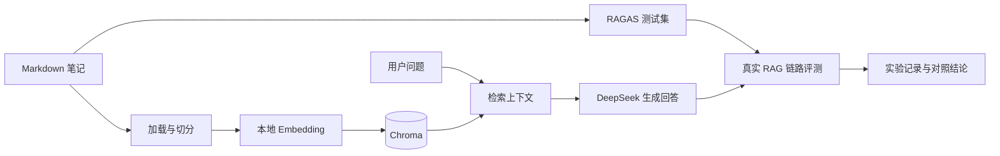

# Personal Notes RAG

一个面向个人 Markdown 笔记的检索增强生成（RAG）实验项目。

这个仓库关注的不是快速拼出一个问答界面，而是建立一套可复盘的 RAG 实验流程：先构建稳定的基线，再生成并固定评测集，随后在相同条件下验证检索与生成策略是否真的带来改进。每个结论都应能回到对应的配置、输出文件和实验记录。

> 项目仍在持续学习和迭代中。README 只描述已经实现或已经验证的能力；后续方向请见 [`docs/ROADMAP.md`](docs/ROADMAP.md)。

## 项目目标

- 将个人 Markdown 笔记构建为可检索的本地知识库。
- 使用本地 Embedding 模型完成检索，并由 DeepSeek 结合检索上下文生成回答。
- 使用 RAGAS 自动生成测试集，量化检索和生成两个环节的表现。
- 用固定测试集和单变量 A/B 实验记录优化过程，包括有效结果与无效结果。

## 当前状态

| 能力 | 状态 | 说明 |
| --- | --- | --- |
| Markdown -> Chroma 向量库 | 已完成 | 固定长度切分、本地 Embedding、持久化向量存储 |
| 向量检索 + DeepSeek 回答 | 已完成 | 当前推荐的基线运行方式 |
| RAGAS 测试集生成与四项指标评测 | 已完成 | 测试集、逐样本结果和排错过程均已保留 |
| 中文 BM25 + 混合检索 | 已实现并完成一次对照 | 当前小规模语料下未优于向量基线，因此不作为默认策略 |
| Prompt 生成约束实验 | 进行中 | 目标是改善 Faithfulness 与 Answer Relevancy |

## 为什么需要实验闭环

RAG 的“回答看起来不错”并不等于系统真正变好了。这个项目将工作拆成三条相互依赖的线：

1. **建库与生成线**：建立最小可用的 RAG 基线。
2. **测试集与评估线**：让系统的检索结果和生成答案可以被统一度量。
3. **检索优化对照线**：在相同语料、测试集、模型和参数下比较候选方案。


```mermaid
flowchart LR
    A[Markdown 笔记] --> B[加载与切分]
    B --> C[本地 Embedding]
    C --> D[(Chroma)]

    Q[用户问题] --> R[检索上下文]
    D --> R
    R --> G[DeepSeek 生成回答]

    A --> T[RAGAS 测试集]
    T --> E[真实 RAG 链路评测]
    G --> E
    E --> X[实验记录与对照结论]
```

## 架构与执行逻辑

### 1. 建库

```text
Markdown documents
  -> DirectoryLoader
  -> RecursiveCharacterTextSplitter
  -> Qwen3-Embedding-0.6B
  -> Chroma
```

默认配置集中在 [`config/settings.py`](config/settings.py)：

- 切分参数：`chunk_size=500`、`chunk_overlap=50`
- 检索数量：`top_k=4`
- Embedding：本地 `Qwen3-Embedding-0.6B`
- 生成模型：DeepSeek OpenAI-compatible API

建库脚本 [`scripts/build_vectorstore.py`](scripts/build_vectorstore.py) 会将切分结果同时写入：

- `chroma_db/`：向量库持久化目录；
- `output/all_chunks.pkl`：同一批 chunk 的本地快照，供 BM25 实验使用。

### 2. 问答主链路

[`scripts/RAG_pipeline.py`](scripts/RAG_pipeline.py) 是实际查询入口：

```text
question
  -> Chroma similarity search (top-k)
  -> retrieved contexts
  -> prompt assembly
  -> DeepSeek response
```

`rag_answer()` 同时返回问题、检索上下文与模型回答，因此评测阶段使用的就是实际 RAG 链路，而非独立模拟数据。

### 3. 测试集与评测

[`scripts/TestsetGenerator.py`](scripts/TestsetGenerator.py) 使用 RAGAS 从 Markdown 笔记生成问题、参考上下文和参考答案；[`scripts/evalute.py`](scripts/evalute.py) 逐条调用 `rag_answer()`，再计算：

- **Faithfulness**：回答是否能被检索上下文支持。
- **Answer Relevancy**：回答是否直接回应问题。
- **LLM Context Precision with Reference**：召回上下文中有用信息的比例。
- **Context Recall**：参考答案所需信息是否被召回。

评测结果包含每条问题的输入、实际检索上下文、回答、参考答案与四项得分，保存在 `output/` 中，便于后续定位具体失败案例。

## 已验证结果

### 向量检索基线

在当前固定的 20 条 RAGAS 测试样本上，纯向量检索基线得到：

| 指标 | 得分 |
| --- | ---: |
| Faithfulness | 0.8172 |
| Answer Relevancy | 0.7979 |
| LLM Context Precision with Reference | 0.8444 |
| Context Recall | 0.9500 |

对应逐样本结果见 [`output/eval_result_baseline.csv`](output/eval_result_baseline.csv)。这组数字只代表当前语料、测试集、模型与配置下的实验结果，并不应被理解为通用性能结论。

### 混合检索对照

项目实现了 BM25 与向量检索的 RRF 融合。排查发现，中文 BM25 必须显式使用 `jieba` 分词；默认的空格分词会把中文长句近似当作一个 token，使关键词检索失效。

在修正分词后，BM25 可以完成词面召回，但在当前语料条件下仍会引入噪声：语料规模较小、来源领域分散、问题通常能由单个主题文档回答，向量检索已经足够稳定。初始混合检索评测结果如下：

| 指标 | 向量基线 | 混合检索 | 变化 |
| --- | ---: | ---: | ---: |
| Faithfulness | 0.8172 | 0.8136 | -0.0036 |
| Answer Relevancy | 0.7979 | 0.7720 | -0.0259 |
| Context Precision | 0.8444 | 0.5844 | -0.2600 |
| Context Recall | 0.9500 | 0.9333 | -0.0167 |

因此，**当前默认策略仍是纯向量检索**。混合检索保留为候选模块，等语料规模扩大、同领域文档重叠增多或出现更多精确术语查询后再重新验证。

详细排查过程、分词验证和结果分析见 [`experiments/检索优化BM25结果记录.md`](experiments/检索优化BM25结果记录.md)。

## 目录说明

```text
RAG/
├── config/                 # 模型、路径、切分和检索参数的统一配置
├── indexing/               # Chroma 的构建与读取封装
├── scripts/
│   ├── test/               # Embedding、LLM、chunk 与链路冒烟测试
│   ├── build_vectorstore.py
│   ├── RAG_pipeline.py
│   ├── TestsetGenerator.py
│   ├── evalute.py
│   └── hybrid_search_optimize.py
├── experiments/            # 终端输出、排错过程、阶段性实验记录
├── output/                 # 测试集、chunk 快照和逐样本评测结果
├── docs/
│   ├── ROADMAP.md          # 未完成任务与验收标准
│   └── RESULTS.md          # 已验证实验的结果索引
├── data/                   # 本地笔记和 PDF，默认不提交
└── chroma_db/              # 本地向量库，默认不提交
```

## 快速开始

### 环境要求

- Python 3.10+
- DeepSeek API Key
- 本地 `Qwen3-Embedding-0.6B` 模型文件
- CUDA 可选；较大语料建议使用 GPU

### 1. 安装依赖

当前依赖版本仍在整理和锁定中。可先安装运行链路所需依赖：

```bash
pip install langchain langchain-community langchain-text-splitters \
  langchain-huggingface langchain-chroma langchain-openai \
  openai ragas pandas tqdm torch pydantic-settings python-dotenv \
  jieba
```

### 2. 配置环境变量与本地模型

```bash
cp .env.example .env
```

```env
DEEPSEEK_API_KEY=sk-your-key
DEEPSEEK_BASE_URL=https://api.deepseek.com
```

将模型放置在 `Pre_Models/Qwen3-Embedding-0.6B`，或者修改 [`config/settings.py`](config/settings.py) 中的 `embedding_model` 路径。

把待检索的 UTF-8 Markdown 文件放入 `data/notes/`。

### 3. 按顺序运行

```bash
# 基础环境检查
python scripts/test/test_embedding.py
python scripts/test/test_llm.py

# 建库
python scripts/build_vectorstore.py

# 验证一次问答链路
python scripts/RAG_pipeline.py

# 生成测试集并评测
python scripts/TestsetGenerator.py
python scripts/evalute.py
```

> 注意：当前提交中的 `scripts/TestsetGenerator.py` 仍含有未解决的 Git 冲突标记。请先完成冲突处理，再执行测试集生成命令；已保存的测试集和评测结果不受这一说明影响。

当笔记内容、切分策略或 Embedding 模型发生变化时，需要重新建库。进行策略对照时，应固定测试集、模型、温度、`top_k` 与非目标变量，避免把多个变化混在一次实验中。

## 实验记录约定

每次实验只改变一个关键变量，并在 [`experiments/`](experiments/) 中记录：

- 实验目标与假设；
- 唯一变量和固定条件；
- 语料与测试集版本；
- 四项指标、运行时间和典型案例；
- 结论，以及下一步是否值得继续投入。

建议新实验使用以下结构：

```markdown
### YYYY-MM-DD - experiment-id
- 目标：
- 假设：
- 唯一变量：
- 固定条件：
- 数据与测试集版本：
- 指标结果：
- 典型案例：
- 结论：
- 下一步：
```

## 当前限制

- 语料、Chroma 数据库与本地模型不随 Git 同步，因此外部开发者可复现流程，但无法直接复现本仓库中的精确分数。
- 评测集当前仅有 20 条 RAGAS 合成样本，适合验证闭环和比较早期策略，不足以支撑泛化结论。
- 当前使用固定长度切分，可能破坏 Markdown 标题层级、代码块和跨段上下文。
- RAGAS 与 LangChain 依赖仍有兼容性处理和弃用警告，需要进一步锁定版本并清理临时代码。
- PDF 加载、来源页码引用、Rerank、元数据过滤等仍处于路线图阶段。

## 文档与证据

- [`docs/ROADMAP.md`](docs/ROADMAP.md)：下一阶段计划、候选实验和验收条件。
- [`docs/RESULTS.md`](docs/RESULTS.md)：已验证结果的汇总索引。
- [`experiments/`](experiments/)：完整终端输出、异常定位和阶段性观察。
- [`output/`](output/)：测试集与逐样本评测 CSV。

## 贡献

欢迎围绕切分、检索、评测与可复现实验提出建议或提交改进。提交前请说明：

- 改动解决的问题；
- 使用的语料范围与测试集版本；
- 是否保持了对照条件；
- 对 RAGAS 指标、典型案例、耗时和成本的影响。

## License

本仓库尚未添加开源许可证。公开复用、分发或接受外部贡献前，建议补充明确的许可证文件，例如 MIT License。
